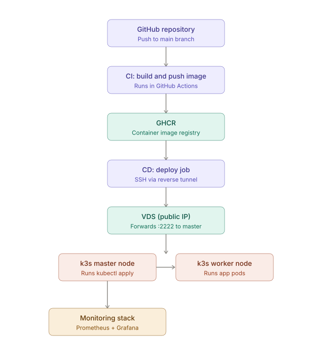
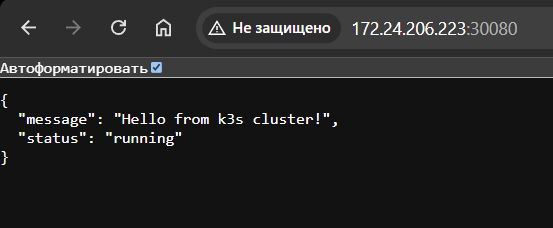
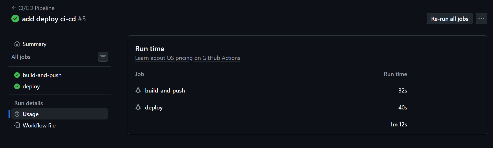
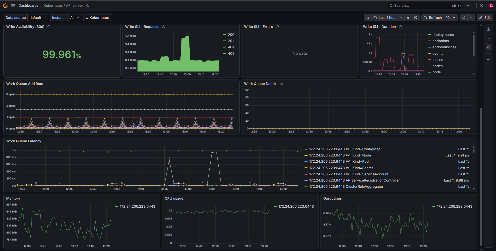
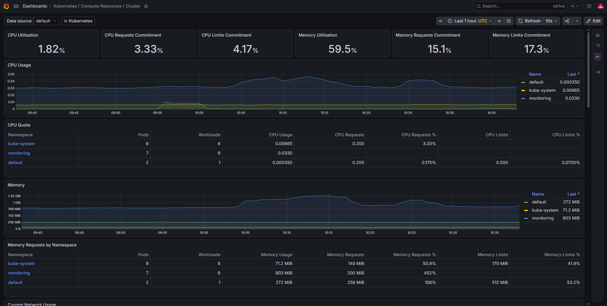
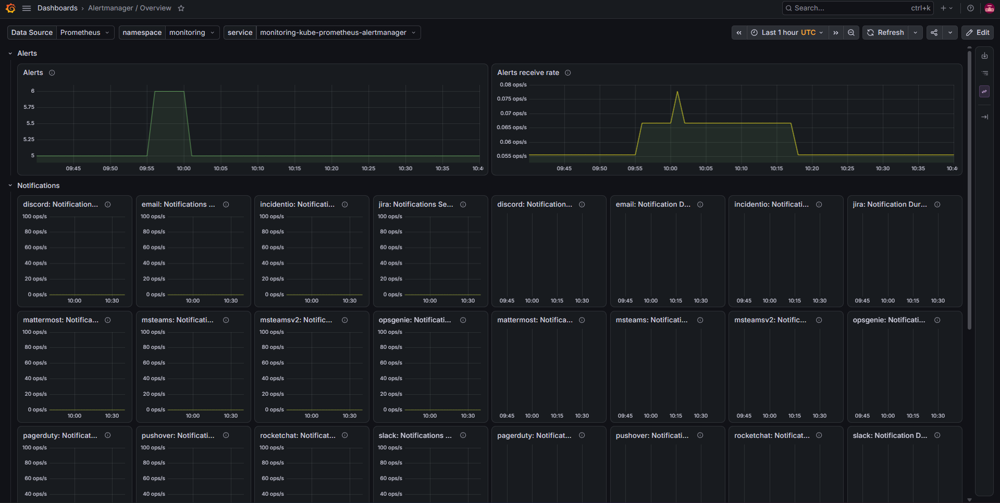
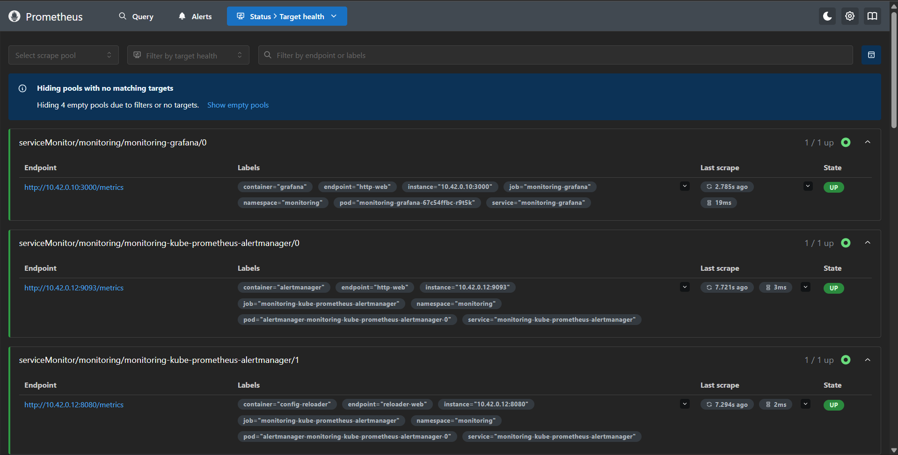

# k3s-demo-app — Django в Kubernetes с полным CI/CD

Учебный DevOps-проект: Django-приложение, упакованное в Docker, развёрнутое в двухнодовом кластере k3s, с автоматической сборкой и деплоем через GitHub Actions и мониторингом на базе Prometheus + Grafana.

Особенность инфраструктуры — кластер поднят на домашних VM без белого IP, поэтому автодеплой из облачного GitHub Actions идёт через обратный SSH-туннель, проброшенный на недорогой VPS с публичным адресом.

## Архитектура



Поток выполнения:

1. Пуш в ветку `main` триггерит workflow в **GitHub Actions**
2. Job **build-and-push** собирает Docker-образ и публикует его в **GHCR** (GitHub Container Registry)
3. Job **deploy** подключается по SSH к **VPS с белым IP**, который держит обратный туннель до домашнего кластера (настроен через `autossh` + systemd на master-ноде)
4. Через туннель выполняется `kubectl apply` на **k3s master node**
5. Master управляет **worker node** и планирует поды приложения на обе ноды
6. **Prometheus + Grafana** (kube-prometheus-stack) собирают метрики со всего кластера

## Стек технологий

- **Приложение**: Django + Gunicorn
- **Контейнеризация**: Docker
- **Registry**: GitHub Container Registry (GHCR)
- **Оркестрация**: k3s (lightweight Kubernetes), 2 ноды — control-plane + worker
- **CI/CD**: GitHub Actions (сборка образа → публикация → деплой по SSH)
- **Мониторинг**: Prometheus, Grafana, Node Exporter, Alertmanager (через Helm-чарт kube-prometheus-stack)
- **Сеть**: обратный SSH-туннель через VPS для обхода NAT домашней сети

## Кластер в работе

```
$ kubectl get nodes
NAME         STATUS   ROLES           AGE     VERSION
k3s-master   Ready    control-plane   6d16h   v1.36.3+k3s1
k3s-worker   Ready    <none>          6d16h   v1.36.3+k3s1

$ kubectl get pods -l app=django-demo
NAME                           READY   STATUS    RESTARTS   AGE
django-demo-7d895d8545-j6njg   1/1     Running   0          39m
django-demo-7d895d8545-mcsb4   1/1     Running   0          39m

$ kubectl get pods -n monitoring
NAME                                                      READY   STATUS    RESTARTS   AGE
alertmanager-monitoring-kube-prometheus-alertmanager-0    2/2     Running   10         6d16h
monitoring-grafana-67c54ffbc-r9t5k                        3/3     Running   12         6d3h
monitoring-kube-prometheus-operator-dccd96b58-86gpm       1/1     Running   4          6d3h
monitoring-kube-state-metrics-5fc5c8d666-nkm5v            1/1     Running   9          6d3h
monitoring-prometheus-node-exporter-bdh7z                 1/1     Running   9          6d16h
monitoring-prometheus-node-exporter-rfws9                 1/1     Running   204        6d16h
prometheus-monitoring-kube-prometheus-prometheus-0        2/2     Running   8          6d3h
```

Приложение отвечает на запросы через NodePort:



## CI/CD pipeline

Workflow состоит из двух job'ов — сборка/публикация образа и деплой в кластер. Оба выполняются автоматически при пуше в `main`.



## Мониторинг

Через kube-prometheus-stack развёрнут полный набор дашбордов для Kubernetes из коробки.

**Kubernetes / API server** — здоровье и производительность control-plane:



**Kubernetes / Compute Resources / Cluster** — потребление CPU и памяти по неймспейсам:



**Alertmanager / Overview** — готовая интеграция с каналами оповещений (Slack, Discord, email, PagerDuty и др.):



Все таргеты Prometheus в состоянии `UP`:



## Как развернуть

### 1. Кластер

```bash
# на master-ноде
curl -sfL https://get.k3s.io | sh -
sudo cat /var/lib/rancher/k3s/server/node-token   # токен для worker'а

# на worker-ноде
curl -sfL https://get.k3s.io | K3S_URL=https://<IP_MASTER>:6443 K3S_TOKEN=<ТОКЕН> sh -
```

### 2. Мониторинг

```bash
helm repo add prometheus-community https://prometheus-community.github.io/helm-charts
helm repo update
kubectl create namespace monitoring
helm install monitoring prometheus-community/kube-prometheus-stack --namespace monitoring
```

### 3. Приложение

```bash
git clone https://github.com/obi228/k3s-demo-app.git
cd k3s-demo-app
kubectl apply -f k8s/deployment.yaml
kubectl apply -f k8s/service.yaml
```

Приложение станет доступно на `http://<IP_master>:30080`.

### 4. CI/CD

Для автодеплоя в GitHub-репозитории нужно задать секреты (`Settings → Secrets and variables → Actions`):

| Secret | Значение |
|---|---|
| `VDS_HOST` | IP публичного сервера-посредника |
| `VDS_TUNNEL_PORT` | порт, на который проброшен SSH master-ноды (например `2222`) |
| `SSH_USER` | пользователь на master-ноде |
| `SSH_PRIVATE_KEY` | приватный ключ для входа на master-ноду |

При пуше в `main` GitHub Actions соберёт образ, опубликует в GHCR и задеплоит его в кластер через туннель.

## Чему научился в процессе

- Настройка k3s-кластера на Hyper-V VM, диагностика типовых сбоев systemd-сервисов (конфликты портов, потеря конфигов после переустановки)
- Deployment/Service манифесты Kubernetes, работа с NodePort
- Публикация и авторизация образов в GHCR
- Построение CD-пайплайна для инфраструктуры без белого IP через reverse SSH-туннель (autossh + systemd)
- Развёртывание и чтение дашбордов kube-prometheus-stack
